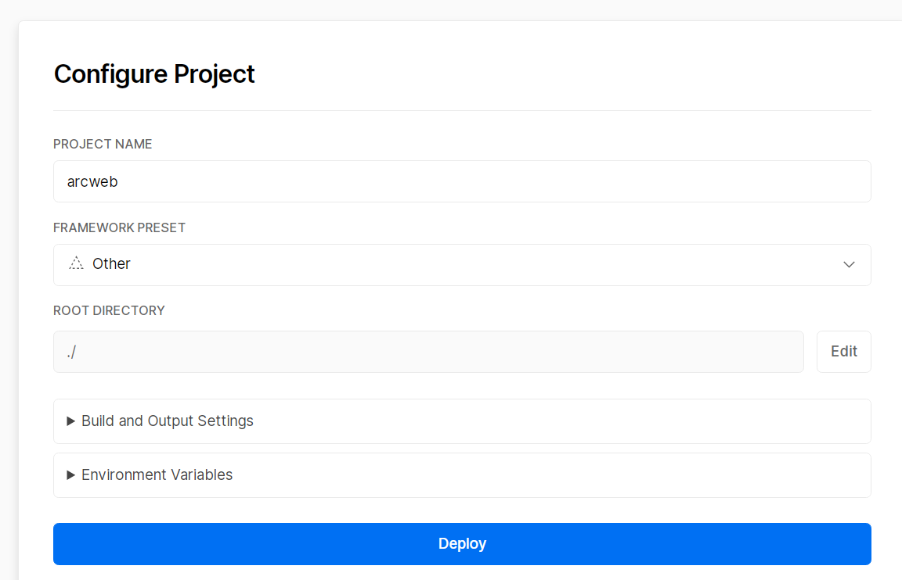

# **Arcweb**

An svg generator for recently played song in arcaea


## Deploy to vercel


Fork this repository and import it from [vercel](https://vercel.com/)



Then configure your project:

Set `FRAMEWORK PRESET` to `Other`

Add `Environment Variables`

```
host = "xxxxxx" # for ArcaeaUnlimitedApi
token = "xxxxxx" # for ArcaeaUnlimitedApi
usercode = "xxxxxx" # your user code in Arcaea
timezone = "xxxxxx" # [optional] Asia/Shanghai for default
```

Click `Deploy `and wait for building
